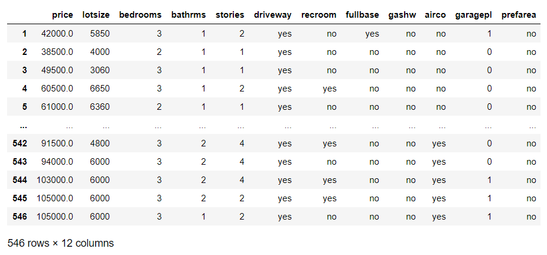
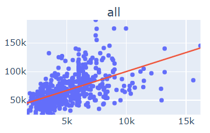
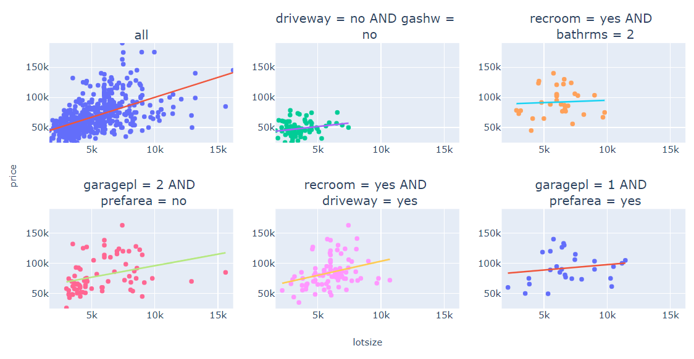

## Exceptional Model Mining (EMM)
Excetional Model Mining is a descriptive modeling technique to discover interesting patterns in datasets.
Whether a pattern is exceptional or not is often quite subjective and dependent on the context.
The columns or attributes of the dataset are divided into two categories: descriptive attributes and target attributes.
Descriptive attributes are used to divide the dataset into subsets, or often called subgroups.
The target attributes will be used to evaluate the interestingness of a subgroup on.
In order to evaluate this interestingness a model is needed to capture the interaction between the target variables 
and a evaluation method to score the interestingness of the interaction.

Best way to explain this technique is by an example. In this example the Windsor housing dataset is used 
(https://vincentarelbundock.github.io/Rdatasets/doc/Ecdat/Housing.html).
The table below shows this dataset:



Our assumption with domain knowledge about houses would be that the price increases if the lotsize increases.
Exceptional subgroups would be subgroups for which the increase would be significantly lower or higher than for the 
whole dataset or even decreasing.
Our model and evaluation metric should include the coëficient for the correlation between lotsize and price, 
the difference between the corelation of the subset and the size of the subset.
If we do not include the size of the subset in the metric we would end up with small subgroups where an exceptional 
might occur but is not very evident by the small amount of examples.

Let's first look at the interaction between the target variables lotsize and price on the full dataset.
In the figure below lotsize is plotted on the x-axis and price on the y-axis.
Each dot represents a row in the dataset and the line is a linear regression through all the data points.



Now we run the EMM algorithm with our as model the (estimated) correlation coefficient between lotsize and price.
We apply this model to the full dataset and every subgroup and score each subgroup by taking the absolute difference 
between the model of the subgroup and the dataset and multiply it by the entropy of the subset and dataset.
Exact formulas can be found in the appendix.
Running the EMM algorithm with settings depth=3, width=10 and above model and metric results in the most 5 interesting 
subgroups as visualized below:



This is just an example to show the application of EMM, many different models and evalutation metrics are possible to 
mine datasets for interesting patterns.

### Installation
For now this module is not available on PyPi (yet). Easiest way to use the package is to clone the git repository and 
import the EMM class to from your own codebase. Cloning as a submodule would be a advisable.

### Usage

#### Quickstart
This easy example demonstrates the basic usage of the EMM module.
The results of running this code would be similar to the example used in the introduction.
```
import pandas as pd
from emm import EMM
df = pd.read_csv('data/Housing.csv', index_col=0)
target_columns = ['lotsize', 'price']
clf = EMM(width=10, depth=2, evaluation_metric='correlation')
clf.search(df, target_cols=target_columns)
clf.visualise(subgroups=5, cols=3) 
```
Both the `EMM()` class en the `search()` method have options that will be discussed in next section.

#### Options
The EMM class has the following configurable parameters:

| Attribute | Type | Default | Options | Description
| --- | --- | --- | --- | --- |
| width | int | None | - | Width parameter of the beam search: amount of subgroups to keep before moving on to the next depth step |
| depth | int | None | - | Depth parameter of the beam search: amount of iterations in the process, subgroups are described by at most *depth* attributes |
| evaluation_metric | str or callable | None | See next section | Function to evaluate the subgroups with. You can choose one of the models described in the next section by referencing them as a string or create your own evaluation function |
| n_jobs | int | -1 | - | Amount of CPU cores to use for the EMM algorithm. To indicate to use all available cores use -1 as value. |
| strategy | str | 'maximize' | ('maximize', minimize') | Indicate if the score of the evaluated subgroups must be maximized or minimized to find the most exceptional subgroups. |
| n_bins | int | 10 | - | For int or float columns of the dataset not all options are used to create subgroups. Values are divided into bins for which the amount of bins can be specified. |
| bin_strategy | str or None | 'equidepth' | ('equidepth', 'equiwidth', None) | Method to create bins for int and float columns. If None is specified all possible values are used to create subgroups. This will increase running time significant. |
| candidate_size | int | width^2 | - | After each (depth) step a pruning algorithm is used to remove overlapping subgroups before proceding to the next step. The candidate size is the amount of subgroups to keep in memory before this pruning proces. By default this is the width squared |

The search method has the following configurable parameters:

| Attribute | Type | Default | Description |
| --- | --- | --- | --- |
| data | pandas.DataFrame | None | Data(Frame) with data to mine for exceptional patterns.
| target_cols | str or list | None | Single column or list of columns with the target attributes. Obviously the supplied columns must be present in the provided DataFrame. |
| descriptive_cols | str ot list | All columns except target columns | Single column or list of columns that can be used to create subgroups with. Specified columns may not overlap with the target columns. |

#### Available models and metrics

##### correlation

##### distribution

##### custom

### References

This module is built on top of the work of the following papers. All models and metrics are originating from these paper.

[1] Wouter Duivesteijn, Ad J. Feelders, and Arno Knobbe. Exceptional Model Mining: Supervised descriptive local pattern mining with complex target concepts. Data Mining and
Knowledge Discovery, 30(1):47–98, 2016.

[2] Matthijs van Leeuwen and Arno Knobbe. Diverse subgroup set discovery. Data Mining and
Knowledge Discovery, 25(2):208–242, September 2012.

[3] Mehdi Kaytoue, Marc Plantevit, Albrecht Zimmermann, Anes Bendimerad, and C´eline Robardet. Exceptional contextual subgraph mining. Machine Learning, 106(8):1171–1211, August 2017.

[4] Florian Lemmerich, Martin Becker, Philipp Singer, Denis Helic, Andreas Hotho, and Markus
Strohmaier. Mining Subgroups with Exceptional Transition Behavior. Proceedings of the 22nd
ACM SIGKDD International Conference on Knowledge Discovery and Data Mining, pages
965–974, Jume 2016.
